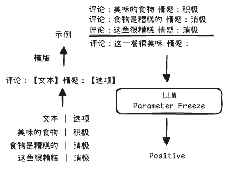

## 上下文学习综述[^1]

### Abstract

随着大语言模型 (LLM) 能力的不断提升，上下文学习 (In-context Learning, ICL) 已成为自然语言处理 (NLP) 的新范式。在该范式中，大语言模型基于一个通过少量示例增强的上下文进行预测。探索 ICL 以评估并外推 LLM 的能力，已成为一个重要的研究趋势。本文旨在综述和总结 ICL 的研究进展与挑战。我们首先给出了 ICL 的形式化定义，并阐明其与相关研究的关联；接着，我们组织并讨论了多种先进技术，包括训练策略、提示设计策略及相关分析；此外，我们还探索了 ICL 的各种应用场景，如数据工程和知识更新。最后，我们指出了 ICL 面临的挑战，并对未来研究方向提出了建议。我们希望这项工作能激励更多旨在揭示 ICL 工作原理并加以改进的研究。

### Introduction

随着模型和数据规模的持续扩张 (Brown et al., 2020; Chowdhery et al., 2023; OpenAI, 2023; Touvron et al., 2023a,b)，大语言模型 (LLM) 展现出了上下文学习 (ICL) 的能力，即从上下文包含的少量示例中进行学习。许多研究表明，LLM 可通过 ICL 执行一系列复杂任务，例如解决数学推理问题 (Wei et al., 2022c)。这些强大的能力已被广泛验证为大语言模型的一种新兴能力 (Wei et al., 2022b)。

上下文学习的核心思想是“通过类比进行学习”。图 1 描述了语言模型如何通过 ICL 进行决策。首先，ICL 需要少量演示示例来构成提示上下文 (Prompt Context)，这些示例通常采用自然语言模板编写。然后，ICL 将用户的查询问题与提示上下文拼接成最终的输入，并将其送入语言模型进行预测。与监督学习不同，监督学习需要一个训练阶段，通过反向传播梯度来更新模型参数，而 ICL 则不涉及任何参数更新。模型被期望能够学习到演示中隐藏的模式，并据此作出正确预测。

> 图 1：上下文学习 (ICL) 示意图。ICL 需要一个包含少量演示示例的提示上下文，这些示例通常用自然语言模板编写。大语言模型将此提示和用户查询作为输入，并负责作出预测。

作为一个新兴范式，ICL 具有多项显著优势。首先，由于演示示例是用自然语言编写的，它为与 LLM 的交互提供了一个可解释的接口 (Brown et al., 2020)。该范式使得通过修改演示和模板来将人类知识融入 LLM 变得异常便捷 (Liu et al., 2022; Lu et al., 2022; Wei et al., 2022c; Wu et al., 2023b)。其次，上下文学习与人类通过类比进行学习的决策过程有相似之处 (Winston, 1980)。第三，与监督学习相比，ICL 是一个“免训练”的学习框架。这不仅能极大地降低模型适应新任务所需的计算成本，也使得“语言模型即服务” (Language-Model-as-a-Service) (Sun et al., 2022) 成为可能，从而能够轻松应用于大规模的真实世界任务。

尽管 ICL 前景广阔，但其中仍存在一些有趣的问题和特殊的性质需要深入探究。虽然一系列基础的 GPT 模型已展现出卓越的 ICL 能力，但多项研究发现，通过在预训练阶段进行适应性调整，该能力可以得到显著提升 (Min et al., 2022b; Li et al., 2024c)。此外，ICL 的性能对具体设置高度敏感，这些设置包括提示模板、演示示例的选择与顺序，以及其他多种因素 (Wang et al., 2023e; Liu et al., 2024b)。同时，优化演示示例的简洁性以及提升 ICL 的计算效率，也是当前研究的关键领域 (Liu et al., 2024a)。更进一步说，尽管已有一些初步的解释 (Dai et al., 2023a; Jiang, 2023)，但 ICL 的深层工作机制至今仍不清晰，有待进一步的探索。

随着 ICL 相关研究的迅速增长，本综述旨在帮助学术界了解该领域的最新进展。在接下来的章节中，我们将深入探讨相关研究，并在图 2 和附录 A 中分别对现有工作进行分类和总结关键发现。我们着重指出了当前面临的挑战和潜在的研究方向，希望能为该领域的初学者提供一份实用的学习路线图，并为未来的研究带来启发。

### Definition and Formulation

遵循 Brown et al. (2020) 的工作，我们在此给出上下文学习的形式化定义：

In-context learning is a paradigm that allows language models to learn tasks given only a few examples in the form of demonstration.
上下文学习是一种允许语言模型仅通过少量演示示例就能学会执行任务的范式。

形式化地，给定一个查询输入文本 _x_ 和一组候选答案 _Y_ = {y1, . . . , ym}，一个预训练的语言模型 _M_ 会以一个演示集 _C_ 为条件，将得分最高的候选答案作为预测结果。演示集 _C_ 包含一个可选的任务指令 _I_ 和 _k_ 个演示示例，因此 _C_ = {_I_, _s_(x1, y1), . . . , _s_(xk, yk)} 或 _C_ = {_s′_ (x1, y1, _I_), . . . , _s′_ (xk, yk, _I_)}，其中 _s′_ (xi , yi , _I_) 是一个根据具体任务用自然语言编写的示例。根据这 _k_ 个演示示例是否属于同一任务，ICL 可被分为特定于任务的 ICL (task-specific ICL) 和跨任务的 ICL (cross-task ICL)。在后一种情况中，不同的示例拥有各自独立的任务指令。对于一个候选答案 yj，其似然概率来自于一个评分函数 _f_ 对整个输入序列的计算：

$$
P(y_j | x) \triangleq f_M(y_j, C, x)
$$

> 给了模型上下文（C）和新问题（x）之后，某个候选答案（yⱼ，比如“积极”）是正确答案的可能性有多大。

最终预测的标签 ŷ 是具有最高概率的候选答案：

$$
\hat{y} = \underset{y_j \in Y}{\arg \max} P(y_j | x).
$$

> 模型在所有选项中进行“择优录取”的数学表达方式。它计算每个选项的得分，然后选择得分最高的那个选项作为它的最终答案。

根据该定义，我们可以看到 ICL 与以下几个相关概念有所不同：
(1) **提示学习 (Prompt Learning)**：提示 (Prompt) 可以是离散的模板，也可以是软参数 (soft parameters)，其作用是引导模型预测出期望的输出。ICL 可被视为提示调优 (prompt tuning) 的一个子类，其中演示示例是提示的一部分。Liu et al. (2023c) 对提示学习进行了全面的综述，但他们的研究未包含 ICL。
(2) **小样本学习 (Few-shot Learning)**：小样本学习是一种通用的机器学习方法，它需要通过少量有监督的样本来调整模型参数以执行特定任务 (Wang and Yao, 2019)。相比之下，ICL 不需要更新参数，而是直接在预训练好的大语言模型上执行。

### Model Training

尽管大语言模型已经直接展示了有前景的 ICL 能力，但许多研究表明，这些 ICL 能力可以通过推理前的专门训练得到进一步增强（Chen et al., 2022; Gu et al., 2023; Shi et al., 2024）。

#### Pretraining

一个提升大语言模型（LLMs）上下文学习（ICL）能力的直接方向是通过预训练或持续预训练。例如，Gu et al. (2023) 和 Shi et al. (2024) 提出通过聚合相关的上下文来重组预训练语料库，使模型学会在先前的演示之间进行推理。不同的是，Li et al. (2024c) 引入了一种元蒸馏预训练过程，该过程允许大语言模型利用被蒸馏后的演示向量进行推理，从而在不影响其效果的前提下提升ICL的效率。

#### Warmup

另一种增强ICL能力的方法是在预训练和ICL推理之间增加一个持续训练阶段，我们简称为模型预热（Warmup）。预热是ICL的一个可选流程，它通过修改或增加参数的方式在推理前对大语言模型进行调整。

由于大多数预训练数据并非为ICL量身定制 (Chen et al., 2022)，研究人员引入了多种预热策略来弥合预训练与ICL推理之间的差距。Min et al. (2022b) 和 Wang et al. (2022b) 都提出在包含多个演示示例的广泛任务上持续微调大语言模型，从而提升其ICL能力。为了促使模型从上下文中学习输入与标签的映射关系，Wei et al. (2023a) 提出了符号微调（symbol tuning），该方法用任意符号（例如，“foo/bar”）来替代自然语言标签（例如，“正面/负面情感”）。Chen et al. (2022) 提出了一种自监督方法，用以将原始文本与下游任务中的ICL格式对齐。此外，多项研究已经指明了指令的潜在价值 (Mishra et al., 2021; Wei et al., 2022a)。通过在超过60个经由自然语言指令模板表达的数据集上对1370亿参数的LaMDA-PT (Thoppilan et al., 2022) 进行微调，FLAN模型 (Wei et al., 2022a) 提升了大语言模型遵循指令的能力，从而增强了其零样本和少样本ICL的性能。Chung et al. (2022) 和 Wang et al. (2022b) 提出使用超过 1000 个任务指令来进一步扩大指令微调的规模。

[^1]: [A Survey on In-context Learning](https://arxiv.org/pdf/2301.00234)
