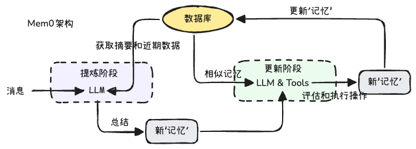
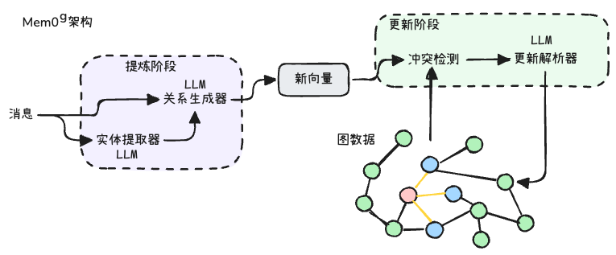

## Mem0: 构建具备可扩展长期记忆的生产级 AI 代理

[Mem0 Paper](https://arxiv.org/abs/2504.19413)

大型语言模型（LLMs）在生成上下文连贯的响应方面展现出卓越的能力，但它们固定的上下文窗口对于在长时间的多会话对话中保持一致性构成了根本性挑战。我们介绍了 Mem0，一种可扩展的以内存为中心的架构，它通过动态提取、整合和检索对话中的关键信息来解决这一问题。在此基础上，我们进一步提出了一种增强型变体，该变体利用基于图的内存表示来捕捉对话元素之间的复杂关系结构。通过在 LOCOMO 基准测试上的全面评估，我们系统地比较了我们的方法与六种基线类别：(i) 已建立的内存增强系统，(ii) 具有不同块大小和 k 值的检索增强生成（RAG），(iii) 处理整个对话历史的全上下文方法，(iv) 开源内存解决方案，(v) 专有模型系统，以及(vi) 专用内存管理平台。 实证结果表明，我们的方法在四个问题类别（单跳、时序、多跳和开放域）中始终优于所有现有记忆系统。值得注意的是，Mem0 在 LLM 作为评判者的指标上比 OpenAI 提高了 26%的相对改进，而带有图记忆的 Mem0 比基础 Mem0 配置的整体得分高出约 2%。除了提高准确性外，与全上下文方法相比，我们还显著降低了计算开销。具体而言，Mem0 将 p95 延迟降低了 91%，并节省了超过 90%的 token 成本，从而在高级推理能力和实际部署限制之间提供了令人信服的平衡。我们的研究强调了结构化、持久性记忆机制在长期对话连贯性中的关键作用，为更可靠和高效的 LLM 驱动 AI 代理铺平了道路。

## Introduction

人类记忆是智力的基础 —— 它塑造我们的身份，指导决策，并使我们能够学习、适应和建立有意义的关系（Craik and Jennings, 1992）。在其众多功能中，记忆对交流至关重要：我们回忆过去的互动，推断偏好，并构建与我们互动对象不断发展的心理模型（Assmann, 2011）。这种在长时间内保持和检索信息的能力使我们能够进行连贯、内容丰富的交流，这些交流可以跨越数天、数周甚至数月。由大型语言模型（LLMs）驱动的 AI 代理在生成流畅、上下文恰当的回应方面取得了显著进步（Yu et al., 2024, Zhang et al., 2024）。然而，这些系统受限于其依赖固定的上下文窗口，这严重限制了它们在长时间互动中保持连贯性的能力（Bulatov et al., 2022, Liu et al., 2023）。**这种局限性源于 LLMs 缺乏能够超越其有限上下文窗口的持久记忆机制。** 虽然人类会自然地积累和组织经验，随着时间的推移形成连续的互动叙事，但 AI 系统无法在会话之间或上下文溢出后持续保存信息。记忆的缺失在人类与AI的 交互中造成了根本性的脱节。没有记忆，AI 代理会忘记用户偏好，重复提问，并反驳先前建立的事实。考虑一个简单的例子，用户在初始对话中提到自己是素食者并避免乳制品。在随后的会话中，当用户询问晚餐推荐时，一个没有持续记忆的系统可能会建议鸡肉，完全与已建立的饮食偏好相矛盾。相比之下，具有持续记忆的系统会保持这些关键用户信息跨会话，并建议合适的素食、无乳制品选项。这个常见场景突显了记忆缺失如何从根本上破坏用户体验和信任。

在对话场景之外，记忆机制已被证明可以显著提升代理在交互环境中的性能（Majumder et al., Shinn et al., 2023）。配备了过去经验记忆的代理能够更好地预测用户需求，从先前的错误中学习，并在不同任务间泛化知识（Chhikara et al., 2023）。研究表明，记忆增强型代理通过利用行动与结果之间的因果关系来改善决策，从而在动态场景中实现更有效的适应（Rasmussen et al., 2025）。分层记忆架构（Packer et al., 2023, Sarthi et al., 2024）和能够自主进化的代理记忆系统（Xu et al., 2025）进一步证明，记忆能够在多个对话会话中实现更连贯的长期推理。

与人类动态整合新信息和修正过时信念不同，一旦信息超出上下文窗口，LLM 就会有效地“重置”（Zhang, 2024, Timoneda and Vera, 2025）。尽管像 OpenAI 的 GPT-4（128K tokens）（Hurst et al., 2024）、o1（200K context）（Jaech et al., 2024）、Anthropic 的 Claude 3.7 Sonnet（200K tokens）（Anthropic, 2025）和 Google 的 Gemini（至少 10M tokens）（Team et al., 2024）等模型不断扩展上下文长度的边界，但这些改进仅仅是延迟而非解决了根本的限制。在实际应用中，即使是这些扩展的上下文窗口也不足以应对两个关键原因。首先，随着有意义的人机关系在数周或数月内发展，对话历史不可避免地会超出最宽松的上下文限制。其次，或许更重要的是，现实世界的对话很少保持主题的连续性。例如，一个用户可能先是提了一句自己的饮食偏好（比如是素食主义者），然后花了好几个小时讨论毫不相关的编程任务，最后又突然话锋一转，回来询问晚餐该吃些什么。在这种情况下，全上下文方法需要处理大量不相关的信息，而关键的饮食偏好可能被埋藏在数千个编程讨论的 token 中。此外，仅仅提供更长的上下文并不能确保有效检索或利用过去的信息，因为注意力机制在处理远距离 token 时会退化（Guo et al., 2024, Nelson et al., 2024）。这一限制在医疗、教育和企业支持等高风险领域尤其成问题，因为在这些领域中，保持连续性和信任至关重要（Hatalis et al., 2023）。为了应对这些挑战，AI 代理必须采用超越静态上下文扩展的记忆系统。一个强大的 AI 记忆系统应该选择性地存储重要信息，整合相关概念，并在需要时检索相关细节——模仿人类的认知过程（He et al., 2024）。通过集成此类机制，我们可以开发出能够保持一致角色、跟踪不断变化的用户偏好并基于先前交流进行构建的 AI 代理。这种转变将使 AI 从短暂、健忘的响应者转变为可靠的长期合作者，从根本上重新定义对话智能的未来。

在本文中，我们解决 AI 系统中的一个根本性限制：它们无法在跨不同会话的扩展对话中保持连贯的推理，这严重限制了与用户的有意义的长期互动。我们介绍了 Mem0（发音为 `mem-zero`），一种新颖的记忆架构，可以动态地捕获、组织和检索正在进行的对话中的重要信息。在此基础上，我们开发了 Mem0g，它通过基于图的记忆表示来增强基础架构，以更好地建模对话元素之间的复杂关系。我们在 LOCOMO 基准测试上的实验结果表明，我们的方法在各种问题类型上始终优于现有的记忆系统——包括记忆增强架构、检索增强生成（RAG）方法以及开源和专有解决方案——同时需要的计算资源也显著降低。延迟测量进一步表明，Mem0 的响应时间比全上下文方法低 91%，在复杂的推理能力和实际部署约束之间取得了最佳平衡。这些贡献代表了朝着能够保持连贯、上下文感知的对话的 AI 系统迈出的有意义的一步，这些对话可以持续很长时间——模仿人类的交流模式，并为个人辅导、医疗保健和个性化援助等应用开辟了新的可能性。

## Proposed Methods

我们为人工智能代理提出了两种记忆架构。(1) Mem0 实现了一种创新的范式，它通过专门的记忆提取与更新模块，来提取、评估并管理对话中的关键信息。该系统能够处理来自两名用户之间，或用户与AI助手之间的一组对话消息。(2) Mem0g 在此基础上进行了扩展，引入了基于图的记忆表示法。在这种表示法中，记忆被存储为带标签的有向图，其中实体为节点，关系为边。这种图结构能够让我们更深刻地理解实体间的内在联系。通过对实体及其关系进行显式建模，Mem0g 能够支持更高级的、跨越多个关联事实的推理，尤其擅长处理那些需要在多个记忆片段中梳理复杂关系路径的查询。

### Mem0

我们的架构遵循增量处理范式，使其能够在持续的对话中无缝运行。如图2所示，完整的流水线架构包括两个阶段：提取和更新。

图2：Mem0系统架构概览，展示了其提取与更新两个阶段。提取阶段负责处理消息和历史上下文，用以生成新的记忆。更新阶段则会评估这些新提取的记忆，将其与已存在的相似记忆进行比对，并通过一个“工具调用”机制来执行相应的操作。数据库作为系统的中央存储库，不仅为整个处理流程提供必要的上下文信息，还负责存储所有经过更新的记忆

提取阶段在接收到新的消息对 (mt−1, mt) 时启动，其中 mt 代表当前消息，mt−1 代表前一条消息，这共同构成了一个完整的交互单元。为了给记忆提炼建立合适的上下文，系统会利用两个互补的信息源：(1) 从数据库中检索到的对话摘要 *S*，它概括了整个对话历史的全局主题；(2) 对话历史中最近的一段消息序列 {mt−m, mt−m+1, ..., mt−2}，其中 m 是一个超参数，用于控制系统回溯近期消息的范围（即“新近度窗口”）。为了让记忆提炼过程能够充分感知和利用上下文，我们实现了一个异步的摘要生成模块，它会周期性地更新对话摘要。由于这个模块独立于主处理流水线运行，因此它既能确保记忆提炼总能获取到最新的上下文信息，又不会拖慢主流程的处理速度。摘要 *S* 提供了对整个对话的宏观主题理解，而近期的消息序列则补充了更为精细的时间线索，这些线索可能包含了尚未被整合进摘要的关键细节。这两个层面的上下文信息与新的消息对相结合，共同构建成一个全面而丰富的提示 *P* = (*S*, {mt−m, ..., mt−2}, mt−1, mt)，并将其提供给一个通过大语言模型（LLM）实现的提炼函数 ϕ。接着，提炼函数 ϕ(P) 会在充分感知对话整体背景的同时，精准地从当前这轮新的对话中提炼出一组关键记忆 *Ω* = {ω1, ω2, ..., ωn}。这些被提炼出的记忆将作为候选事实，等待下一步被纳入知识库。

在提取完成后，更新阶段会评估每一个候选事实与现有记忆的关联，以确保知识库的一致性并避免信息冗余。该阶段的核心任务是为每一个新提取的事实 ωi ∈ *Ω* 决定最合适的记忆管理操作。针对每个事实，系统首先会利用向量嵌入技术，从数据库中检索出 *s* 个语义最相似的记忆。随后，这些被检索到的记忆会连同候选事实一起，通过一个我们称之为‘工具调用’（tool call）的函数调用接口，被提交给大语言模型（LLM）。LLM 会自行判断并决定执行以下四种操作之一：当不存在语义等价的记忆时，执行 **ADD** 操作创建新记忆；当新信息可以补充现有记忆时，执行 **UPDATE** 操作进行增强；当新信息与现有记忆矛盾时，执行 **DELETE** 操作予以移除；或者，当候选事实无需修改知识库时，执行 **NOOP**（无操作）。我们没有采用独立的分类器，而是直接利用 LLM 强大的推理能力，让它根据候选事实与现有记忆之间的语义关系来选择最合适的操作。决策做出后，系统将执行相应的操作，从而确保知识库内容的连贯性与时效性。

在我们的实验评估中，我们将系统配置为使用 `m = 10` 条先前的消息作为上下文参考，并使用 `s = 10` 个相似的记忆进行比较分析。所有语言模型操作都使用 GPT-4o-mini 作为推理引擎。向量数据库采用密集嵌入，以促进更新阶段的高效相似性搜索。

### Mem0g

Mem0g 的处理流水线（如图 3 所示）采用了一种基于图的记忆方法，能够高效地从自然语言交互中捕捉、存储和检索上下文信息 (Zhang et al., 2022)。在该框架中，记忆被表征为一个有向标记图 G = (V, E, L)，其中：

- **节点 V** 代表各类实体（例如：`Alice`、`San_Francisco`）。
- **边 E** 代表实体之间的关系（例如：`lives_in`）。
- **标签 L** 为节点赋予语义类型（例如：`Alice` - 人物，`San_Francisco` - 城市）。

图 3：Mem0g 的基于图的记忆架构，展示了其核心的 实体提取与更新阶段。在提取阶段，系统利用大语言模型（LLM）将对话消息转化为结构化的实体及关系三元组。而在更新阶段，当需要将新信息整合进现有的知识图谱时，系统会启用冲突检测与解决机制，以确保数据的一致性。

每个实体节点 v ∈ V 包含三个核心部分：(1) 用于对实体进行分类的**实体类型**（如：人物、地点、事件）；(2) 用于捕捉实体语义信息的**嵌入向量** ev；以及 (3) 包含创建时间戳 tv 等信息的**元数据**。我们系统中的关系则被结构化为 (vs, r, vd) 形式的三元组，其中 vs 和 vd 分别是源实体节点和目标实体节点，r 则是连接它们的带标签的边。

提取过程采用一个两阶段流水线，利用大语言模型（LLM）将非结构化文本转化为结构化的图表示。首先，一个**实体提取器**模块会处理输入文本，识别出一系列实体及其对应的类型。在我们的框架中，实体是对话中的关键信息要素——涵盖了人、地点、物体、概念、事件以及其他任何值得在记忆图中进行表征的属性。实体提取器通过分析对话元素的语义重要性、独特性和持久性来识别这些多样化的信息单元。例如，在一段关于旅行计划的对话中，实体可能包括目的地（城市、国家）、交通方式、日期、活动以及参与者的偏好——本质上是任何可能对未来参考或推理有价值的离散信息。

接下来，一个**关系生成器**组件会在这些实体之间推导出有意义的连接，从而建立起一组能够捕捉信息语义结构的关系三元组。这个基于 LLM 的模块会分析已提取的实体及其在对话中的上下文，以识别出具有重要语义的关联。它通过审视语言模式、上下文线索和领域知识来判断实体间的相互关系。对于每一个潜在的实体对，生成器都会评估是否存在有意义的关联，如果存在，便会为其分配一个恰当的标签（如 `lives_in`、`prefers`、`owns`、`happened_on`）。该模块利用了先进的提示工程技术，引导 LLM 对话中的显式陈述和隐式信息进行推理，最终生成的关系三元组构成了我们记忆图中的边，从而支持跨越多个互联信息的复杂推理。在整合新信息时，Mem0g 采用了一套精密的存储与更新策略。对于每个新的关系三元组，我们会计算其源实体和目标实体的嵌入向量，然后搜索知识库中是否存在语义相似度高于预设阈值 `t` 的现有节点。根据节点的存在情况，系统可能会创建两个新节点、仅创建一个节点，或直接利用现有节点来建立关系，并附上相应的元数据。为了维护知识图的一致性，我们还实现了一个冲突检测机制，当新信息进入时，该机制能够识别出可能与之冲突的现有关系。一个基于 LLM 的更新解析器会判断某些关系是否已经过时，并将其标记为无效，而不是直接物理删除，从而保留进行时间维度推理的能力。

Mem0g 的记忆检索功能实现了一种双轨并行的策略，以实现最优的信息访问。**实体中心法**首先会识别查询中的关键实体，然后利用语义相似性在知识图中定位相应的节点。它会系统性地探索这些“锚点”节点的全部入向和出向关系，构建一个能够捕捉相关上下文信息的综合子图。与此互补的是**语义三元组法**，它采取了更宏观的视角，将整个查询编码成一个密集的嵌入向量。这个查询向量会与知识图中每个关系三元组的文本编码进行匹配。系统会计算查询与所有可用三元组之间的细粒度相似度得分，并仅返回那些超过可配置相关度阈值的三元组，按相似度降序排列。这种双重检索机制使得 Mem0g 能够同等高效地处理针对性强的实体查询和更宽泛的概念性查询。

从技术实现上看，本系统采用 Neo4j 作为底层图数据库。基于 LLM 的提取器和更新模块则利用了具备函数调用（function calling）能力的 GPT-4o-mini，这使得从非结构化文本中进行结构化信息提取成为可能。通过将基于图的表示方法、语义嵌入技术以及基于 LLM 的信息提取能力相结合，Mem0g 既实现了复杂推理所需的结构丰富性，也具备了自然语言理解所需的语义灵活性。

从实现的角度来看，该系统利用 Neo4j1 作为底层图形数据库。基于 LLM 的提取器和更新模块利用具有函数调用功能的 GPT-4o-mini，允许从非结构化文本中进行结构化信息提取。通过将基于图的表示与语义嵌入和基于 LLM 的信息提取相结合，Mem0g 实现了复杂推理所需的结构丰富性和自然语言理解所需的语义灵活性。

## Conclusion and Future Work

我们提出了 Mem0 与 Mem0g 这两种互补的记忆架构，旨在突破大语言模型（LLM）固定上下文窗口的固有局限。Mem0 通过动态地提取、整合并检索紧凑的记忆表征，在单跳及多跳推理任务中展现出顶尖性能；而 Mem0g 则借助其基于图的扩展，在时间感知和开放域任务上取得了显著的成效。在 LOCOMO 基准测试中，我们的方法在单跳、时间及多跳三类推理问题上，相较于各类别的最佳方法，分别实现了 5%、11% 和 7% 的相对性能提升，并将 p95 延迟相较于全上下文基线降低了超过 91%，这充分证明了其在精确性与响应速度之间实现了卓越的平衡。Mem0 的密集型记忆管道擅长快速检索直接查询，能最大限度地减少 Token 消耗和计算开销。相比之下，Mem0g 的结构化图表征则提供了更精细的关系清晰度，使其能够在不牺牲实用效率的前提下，完成复杂的事件排序和丰富的上下文融合。两者共同构成了一个功能全面的记忆工具套件，既能适应多样化的对话需求，又具备大规模部署的潜力。

未来的研究方向包括：优化图操作以降低 Mem0g 的延迟开销；探索能够融合高效率与强关系表征能力的分层记忆架构；并从人类认知过程中汲取灵感，开发更为精密的记忆整合机制。

此外，将此记忆框架的应用从对话场景拓展至程序推理、多模态交互等更广阔的领域，将能进一步验证其普适性。通过攻克固定上下文窗口这一根本性难题，我们的研究工作代表着对话式人工智能向前迈出了重要一步——使其能够像人类一样，进行长期、连贯且富含上下文的深度交互。
